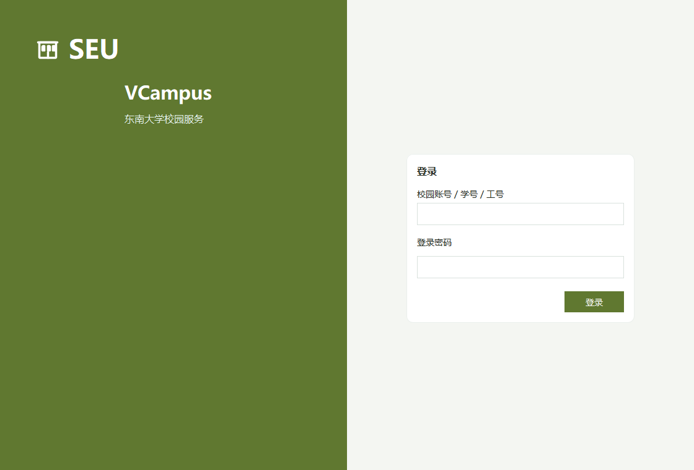
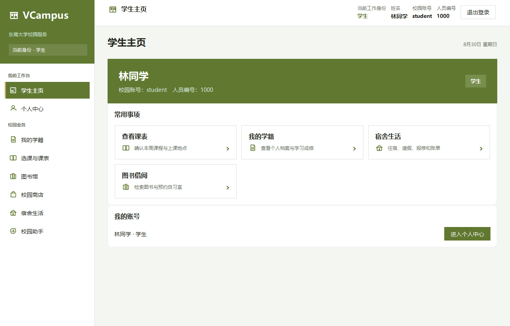
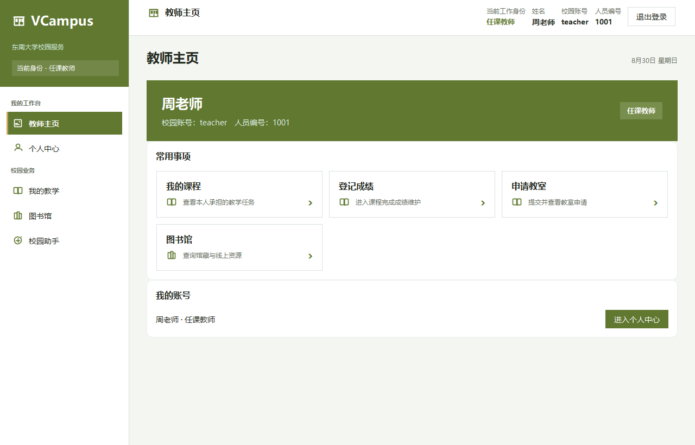
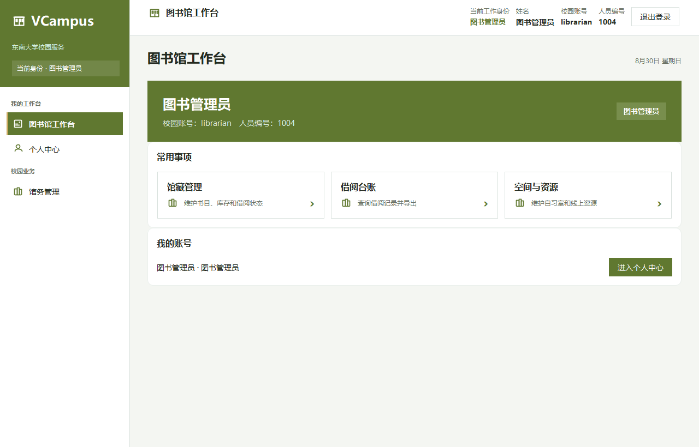
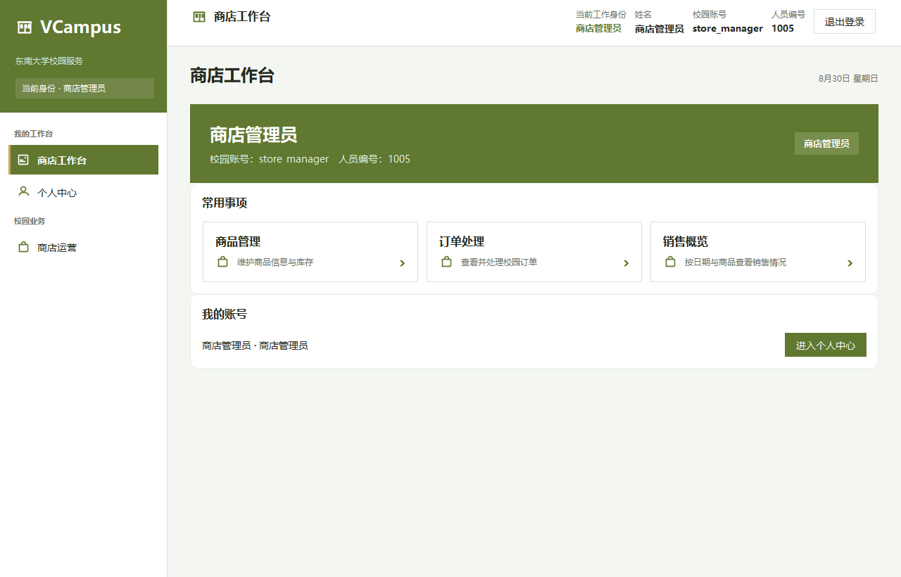
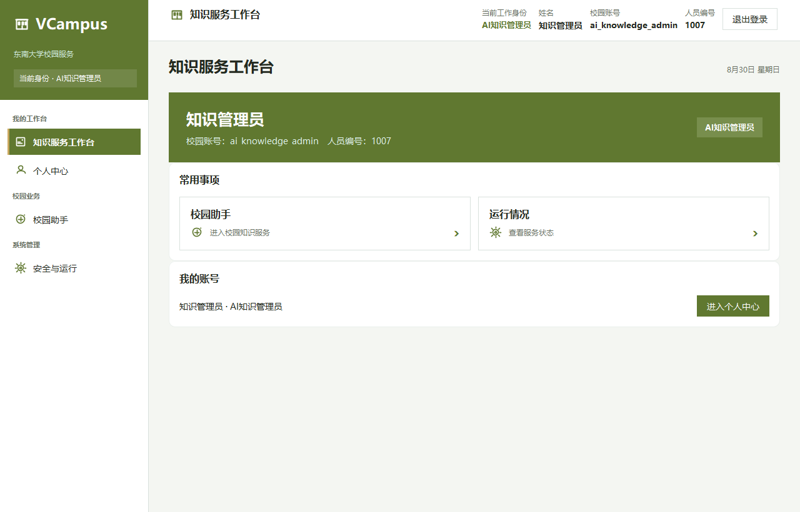
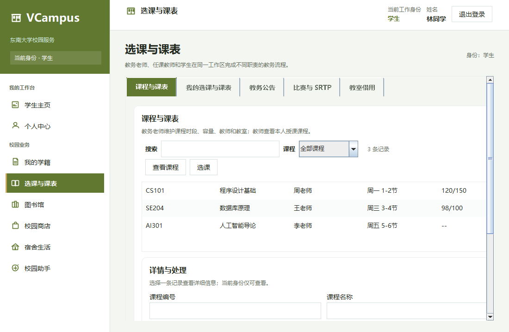
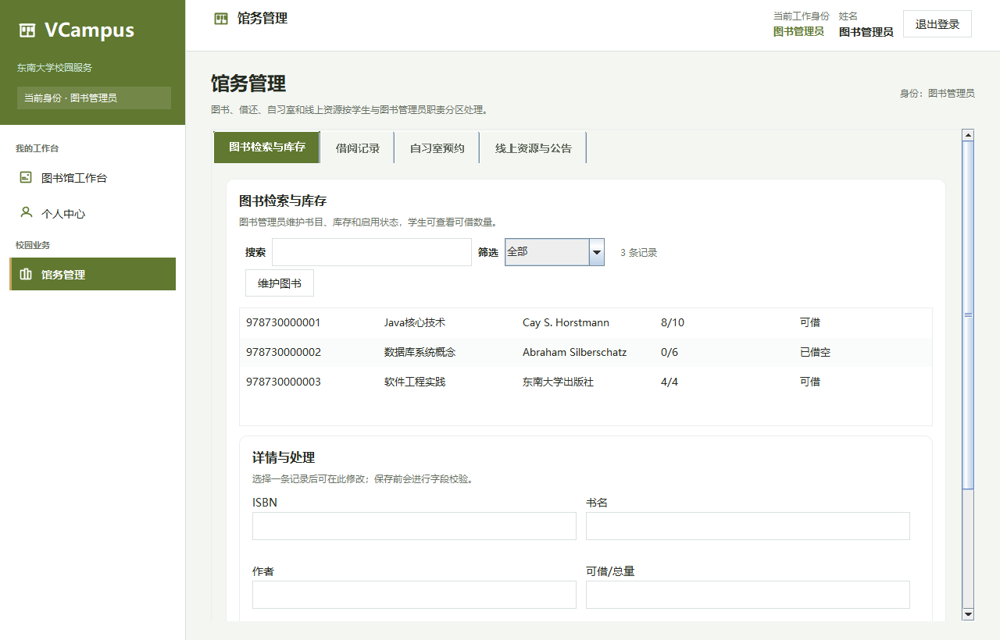
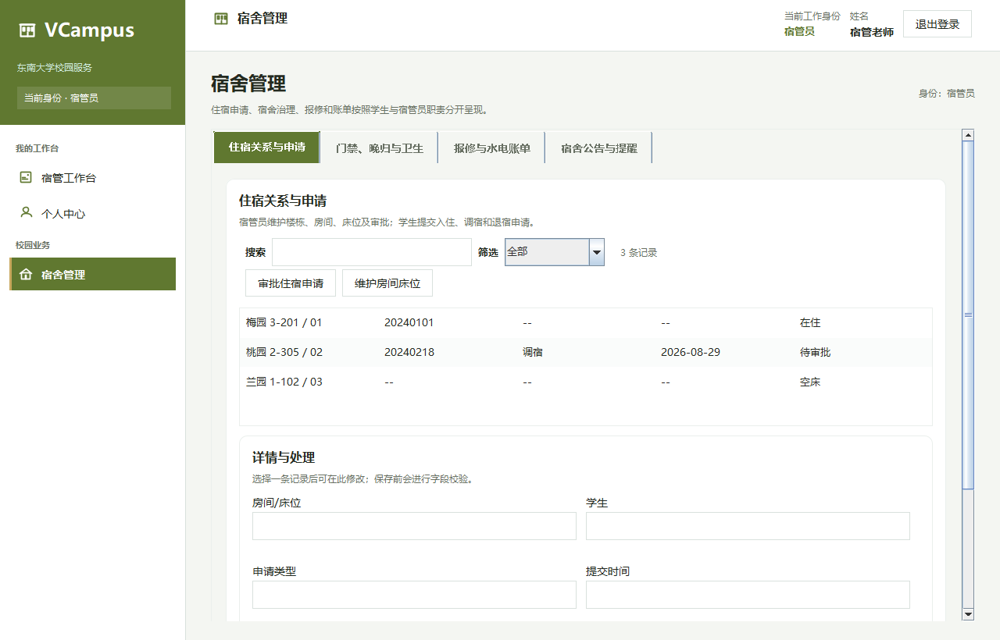
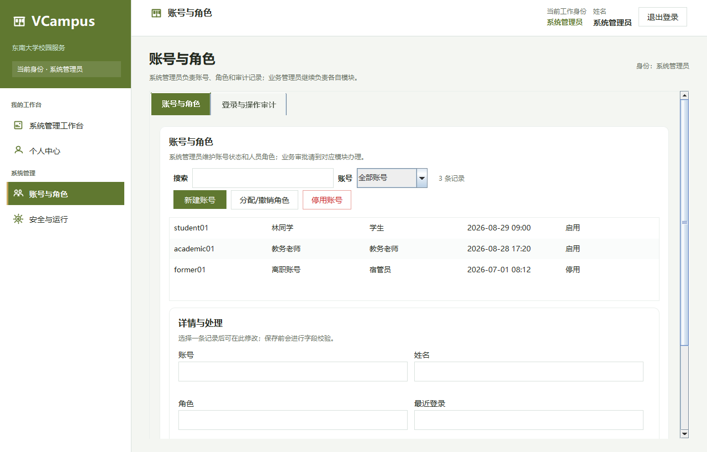

# UI 视觉证据画廊

这里集中放置当前 Swing 客户端的登录、职责外壳和代表性业务页截图，用于快速查看信息架构、人员分流和页面布局。角色外壳截图由本地预览会话生成；业务截图用于查看页面结构。它们不等同于真实数据库记录，功能闭环和权限结果以 [需求追踪矩阵](REQUIREMENT_TRACEABILITY.md)、自动化测试及数据库证据为准。

## 登录入口

登录页只填写校园账号、学号或工号和密码，不选择人员或角色。服务端匹配数据库中的唯一用户、姓名、用户编号和职责，登录成功后建立会话并进入对应工作台；同一账号拥有多个职责时，登录后才可切换已有职责。

## 九类职责主页

登录成功后按当前职责显示独立的主页标题、快捷任务和侧栏。侧栏只保留当前职责可以进入的模块；同一账号拥有多个职责时，顶部才出现身份切换器。

### 学生

学生侧栏聚合我的学籍、选课与课表、图书馆、校园商店和宿舍生活。

### 任课教师

教师侧栏聚合我的教学和图书馆，教学相关入口与学生选课入口分开。

### 学籍管理员

学籍管理员进入学籍工作台，处理学生档案和成绩档案。

### 教务老师

教务老师进入教务工作台，快捷处理课程、排课、教室和校园活动。

### 图书管理员

图书管理员进入图书馆工作台，集中处理馆藏、借阅、空间和线上资源。

### 商店管理员

商店管理员进入商店工作台，快捷处理商品、订单和销售概览。

### 宿管员

宿管员进入宿管工作台，快捷处理住宿、申请审批和生活服务。

### AI 知识管理员

知识管理员进入知识服务工作台，只显示已经接通的系统运行入口。校园助手尚未接入真实服务，因此不显示入口。

### 系统管理员

系统管理员进入系统管理工作台，快捷处理账号、会话和安全审计，不显示其他业务模块的写入口。

## 代表性业务页

模块页在主导航下继续按任务切分。以下截图用于查看筛选、表格、表单和高风险操作入口的布局；窗口尺寸以文件名为准。

### 学生业务

学生在课程模块中查看课程与课表；选退课等改变状态的操作需经过确认并由服务端复核。
课程、资源、请假、报修、竞赛、教室申请和账号设置均从学生侧栏进入；具体任务状态以页面与服务端返回为准。

### 教务业务

教务老师选中课程后，在课程页专用区域行内新增、修改和删除排课时段；星期、节次、日期、教室和稳定时段编号均可核对，冲突错误回显在当前任务区。教务工作台外壳见上方职责主页截图。

### 图书馆业务

图书管理员在同一工作台内进入馆藏、借阅、自习室、线上资源和公告任务。
线上资源访问日志、借阅台账筛选与 CSV 导出位于馆务管理的对应任务页；单次导出最多 5000 条，覆盖已有文件前需确认。

### 商店业务

商店管理员在工作台进入商品、订单和销售概览任务；销售统计按自然日、商品编号和关键字查看已支付订单聚合结果。

### 宿舍业务

宿管员在同一工作台内进入空间、住宿、审批、报修、巡查和账单任务。
请假审批、空间维护、住宿关系、报修、巡查和账单均在宿舍管理的对应任务页内完成；床位占用由事务和数据库约束共同保证。

### 系统管理业务

系统管理员的账号与安全任务集中在系统管理工作台。
会话、注销审批、登录审计和系统监控位于对应任务页；页面不返回 raw token，批准注销在事务提交后使相关会话失效。

## 明确延期的能力

画廊不展示后台预警/账单定时调度器或真实 AI、RAG、外部知识库和写操作工具；边界见 [功能基线](FEATURE_BASELINE.md) 和 [实施路线](IMPLEMENTATION_ROADMAP.md)。
